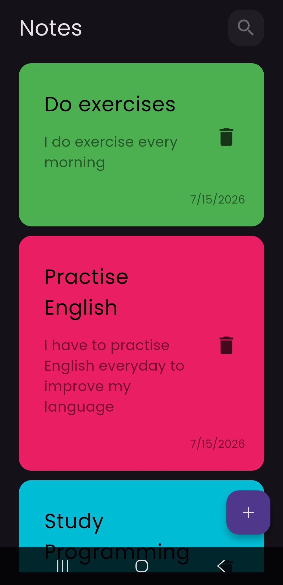
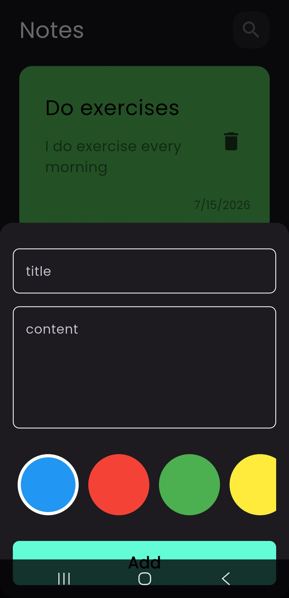
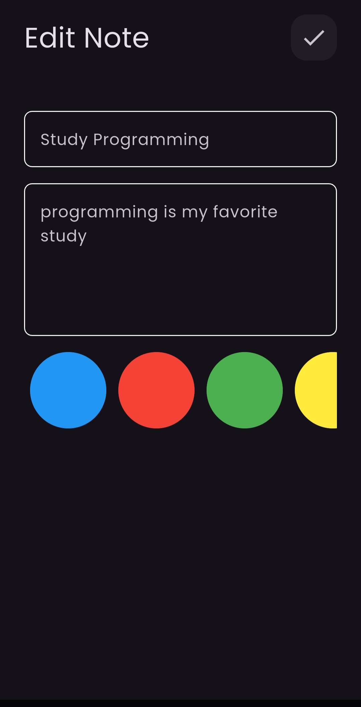

# 📝 Notes App

A beautiful, lightweight, and offline-first mobile notes application built using **Flutter** and **Dart**. The application allows users to seamlessly create, read, update, and delete (CRUD) notes locally on their devices with robust state management and offline database integration.

---

## 🚀 Features

* **Full CRUD Operations:** Add, view, edit, and delete notes easily.
* **Offline Storage:** Save and retrieve notes instantly using a fast local database.
* **Custom Colors:** Assign different colors to your notes for better organization and visual appeal.
* **Search Functionality:** Quickly find specific notes using a dynamic search feature.
* **Responsive & Modern UI:** Clean, intuitive interface with smooth animations and transitions.

---

## 🛠️ Tech Stack & Architecture

The project is built using modern Flutter development standards and clean separation of concerns:

* **Framework:** [Flutter](https://flutter.dev) (v3.x)
* **Language:** [Dart](https://dart.dev)
* **State Management:** **Bloc & Cubit** (for predictable and reactive UI state management)
* **Local Database:** **Hive** (a lightweight, super-fast key-value database written in pure Dart, perfect for offline data)
* **Design Pattern:** Feature-First Architecture / MVVM

---

## 📸 Screenshots

| Notes List | Add / Edit Note |
| :---: | :---: |
|  |  | 

---

## ⚙️ How to Run the Project

Follow these steps to run the application locally on your machine:

1. **Clone the repository:**
   ```bash
   git clone [https://github.com/Mohamed-Rajab1/notes_app.git](https://github.com/Mohamed-Rajab1/notes_app.git)

   2. Navigate into the project directory:
   ```bash
   cd notes_app

   3. Get Flutter dependencises:
   ```bash
   flutter pub get

   4. Run the application:
   ```bash
   flutter run